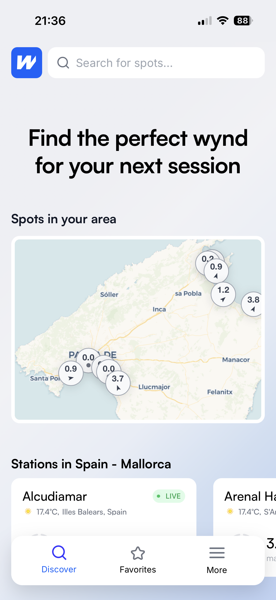
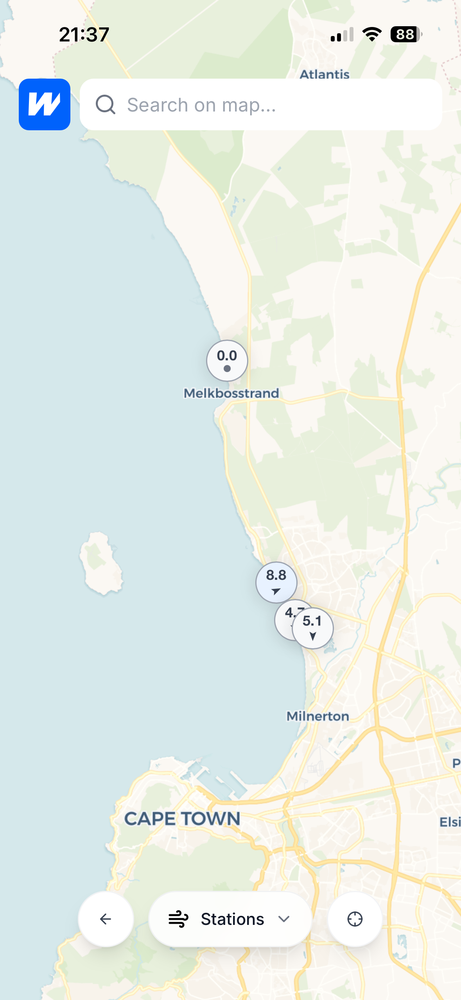
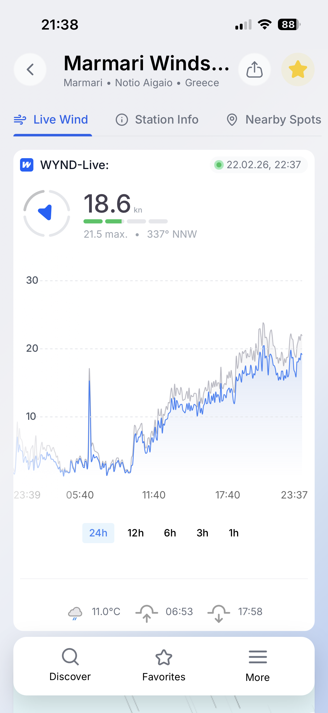
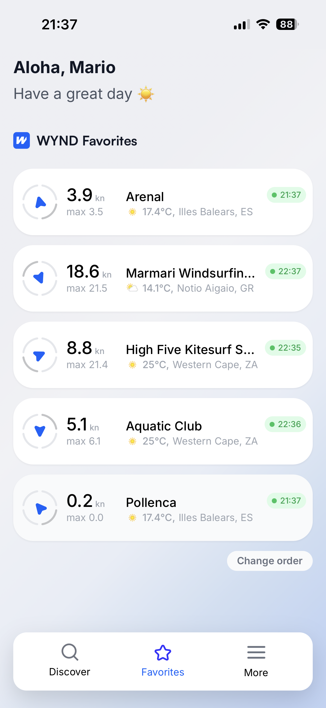

  

  # wynd

  ### Feel the moment. Ride the wind.

  **Real-time hyperlocal wind & weather data for kitesurfers, windsurfers, and water sports enthusiasts.**

   

  Also available as a **[Web App](https://www.wynd.live)**

---

## Features

**Live Wind Data** — Real-time wind speed, direction, and gusts from stations worldwide. Updated every few minutes.

**Interactive Map** — Find spots and stations near you. See live wind conditions at a glance.

**Spot Discovery** — Browse wind and water sports spots with condition ratings. Find the perfect spot for your next session.

**Favorites** — Save your go-to stations and spots. Check conditions instantly.

**Station Details** — 24h wind charts, temperature, sunrise/sunset, and more. All the data you need before heading out.

**Multi-Source Data** — Aggregated from multiple weather data providers for maximum coverage and accuracy.

**Web, iOS & Android** — Use it in the browser or download the native app.

---

## Screenshots

  &nbsp;&nbsp;
  &nbsp;&nbsp;
  &nbsp;&nbsp;
  

---

## Contact

- **Email**: [contact@wynd.live](mailto:contact@wynd.live)
- **Website**: [www.wynd.live](https://www.wynd.live)

---

  Made with ♥ by wynd

